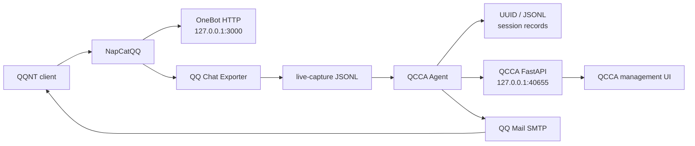

# QCCA-NapCat-QCE

> A Windows x64 bundle that combines NapCatQQ, QQ Chat Exporter, and QCCA.

<p align="center">
  
</p>

[](LICENSE)
[](#requirements)
[](#requirements)

**Language:** [中文](README.md) | [English](README.en.md)

---

## Overview

This is a Windows x64 bundle containing NapCatQQ, QQ Chat Exporter, and QCCA. NapCatQQ handles QQ login and the OneBot interface, QQ Chat Exporter exports and browses records, and QCCA watches QCE live-capture files before invoking a coding agent. QCCA also exposes a local FastAPI management page.

### Data flow



## Components

| Component | Version / purpose |
| --- | --- |
| [NapCatQQ](https://github.com/NapNeko/NapCatQQ) | v4.18.19, QQ and OneBot interface |
| [QQ Chat Exporter](https://github.com/shuakami/qq-chat-exporter) | v5.5.80, export and browse QQ chat records |
| QCCA | v1.1.0; watches messages, invokes coding agents, and replies through QQ Mail |
| QCCA API | Local FastAPI management service |

## Features

- Export and browse QQ chat records.
- Watch QQ Chat Exporter `live-capture` JSONL messages.
- Send text messages to a Codex Agent.
- Transcribe voice messages with FunASR before processing.
- Reply to message senders through QQ Mail SMTP.
- Manage existing workspace sandbox permissions, session records, and sender QQ accounts from a local web page.

## What's New In 1.1.0

- The management page now shows live Agent status, including the active workspace, session, and session ID.
- Chat records can be opened by selecting a session; the page displays the latest 200 records.
- Each session stores its records in a separate UUID-named JSONL file for easier backup and troubleshooting.
- The source tree and release directories now use the same record endpoints and storage paths.

## Quick Start

1. Extract the full package anywhere.
2. In a release package, double-click `QCCA-NapCat-QCE.exe`; from a source checkout, run `launcher-user.bat`.
3. Sign in through the QQ client.
4. Open `http://localhost:40653/qce` and enter the console access token.
5. Open `http://localhost:40653/qce/qcca/` to manage QCCA.

### First-run checklist

- QQNT is installed and can launch normally.
- Use `QCCA-NapCat-QCE.exe` for a release package, or `launcher-user.bat` from a source checkout.
- After login, verify `http://127.0.0.1:3000`, `http://127.0.0.1:40653/qce`, and `http://127.0.0.1:40655/health`.
- If mail replies are needed, enter an authorization code for the sender QQ in the QCCA management page.
- The first voice-processing run may load the FunASR model; allow time and disk space for initialization.

In a release package, the launcher console remains visible during the first QR-code login and is hidden automatically after NapCat reports a valid QQ number. The QQ client window itself remains visible.

When the hidden launcher is running, QCCA shows an icon in the Windows notification area. Double-click it to open the management page, or right-click it to check status, stop QCCA, or exit QQ, NapCat, and QCCA.

Run `start-standalone.bat` to browse already exported records without signing in to QQ. Standalone mode does not start QCCA.

## QCCA Configuration

QCCA automatically creates and maintains QQ users, workspaces, and sessions while it processes messages. The management page can change sandbox permissions for existing workspaces, select the sender QQ, and store the QQ Mail authorization code for each sender.

The currently signed-in QQ is reserved automatically as an SMTP sender. SMTP authorization codes are stored in plaintext on this computer. Protect this file carefully:

```text
%USERPROFILE%\.qq-chat-exporter\qcca\workspace\smtp.json
```

Session chat records are stored as JSONL, with one UUID-named file per session:

```text
%USERPROFILE%\.qq-chat-exporter\qcca\record\<session-id>.jsonl
```

The default watched directory is `%USERPROFILE%\Documents\QQChatExporter\live-capture`. Set `QCCA_WATCH_DIR` before launch to change it. Set `QCCA_API_PORT` to change the API port.

## Local Services

| Address / port | Purpose |
| --- | --- |
| `127.0.0.1:3000` | NapCat OneBot HTTP API used by QCCA |
| `127.0.0.1:40653` | QQ Chat Exporter web page and API |
| `127.0.0.1:40654` | QQ Chat Exporter and NapCat bridge |
| `127.0.0.1:40655` | Default QCCA FastAPI management service port |

## Requirements

- QQNT installed locally.
- Python 3.10 or later for QCCA.
- `ffmpeg` for AMR-to-WAV conversion.
- Node.js 18 or later for standalone mode only.

## Credits and License

- NapCat: [NapNeko/NapCatQQ](https://github.com/NapNeko/NapCatQQ)
- QQ Chat Exporter: [shuakami/qq-chat-exporter](https://github.com/shuakami/qq-chat-exporter)

This project preserves upstream attribution and is licensed under [GNU General Public License v3.0](https://www.gnu.org/licenses/gpl-3.0.html). See [LICENSE](LICENSE) for the complete license.
