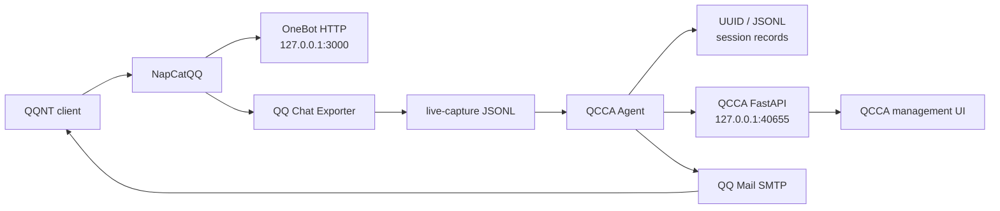

# QCCA-NapCat-QCE

> A Windows x64 bundle that combines NapCatQQ, QQ Chat Exporter, and QCCA.

<p align="center">
  
</p>

[](LICENSE)
[](#requirements)
[](#requirements)

**Language:** [中文](README.md) | [English](README.en.md)

---

## Overview

This is a Windows x64 bundle containing NapCatQQ, QQ Chat Exporter, and QCCA. NapCatQQ handles QQ login and the OneBot interface, QQ Chat Exporter exports and browses records, and QCCA watches QCE live-capture files before invoking a coding agent. QCCA also exposes a local FastAPI management page.

### Data flow



## Components

| Component | Version / purpose |
| --- | --- |
| [NapCatQQ](https://github.com/NapNeko/NapCatQQ) | v4.18.19, QQ and OneBot interface |
| [QQ Chat Exporter](https://github.com/shuakami/qq-chat-exporter) | v5.5.80, export and browse QQ chat records |
| QCCA | v1.2.1; watches messages, invokes Codex or Claude, and replies through QQ Mail |
| QCCA API | Local FastAPI management service |

## Features

- Export and browse QQ chat records.
- Watch QQ Chat Exporter `live-capture` JSONL messages.
- Select Codex or Claude per session to process text messages.
- Transcribe voice messages with FunASR before processing.
- Reply to message senders through QQ Mail SMTP.
- Manage the Agent type, sandbox permissions, session records, and sender QQ accounts from a local web page.
- Use the first-run wizard and one-page status overview to check NapCat, QCE, QCCA, Agent, audio, and SMTP at a glance.

## What's New In 1.2.1

- Added Codex / Claude multi-Agent support. Sessions can switch Agent through QQ commands or the management page.
- Added an Agent registry and isolated adapters so more coding Agents can be integrated without changing the message-processing flow.
- Sessions now use globally unique UUIDs and store human-Agent conversations in separate JSONL files.
- QCCA injects the current session's shared memory when invoking an Agent, so switching Agent preserves the QCCA conversation context.
- The management page shows Agent runtime status, workspace, session, session ID, and the latest 200 chat records.
- Existing sessions now have an Agent selector while workspace paths, session names, and session IDs remain read-only.
- Improved `/agent`, `/status`, `/sessions`, and `/cancel` commands and failure-state reporting.
- Added a first-run setup wizard for environment checks, the default Agent for new sessions, and the current QQ Mail authorization code.
- Added a unified runtime status overview with plain-language recovery actions when a service is unavailable.

## Quick Start

1. Extract the full package anywhere.
2. In a release package, double-click `QCCA-NapCat-QCE.exe`; from a source checkout, run `launcher-user.bat`.
3. Sign in through the QQ client.
4. Open `http://localhost:40653/qce` and enter the console access token.
5. Open `http://localhost:40655/qcca/` to manage QCCA. This standalone entry is served by QCCA and does not depend on the QCE web server.

### First-run checklist

- QQNT is installed and can launch normally.
- Use `QCCA-NapCat-QCE.exe` for a release package, or `launcher-user.bat` from a source checkout.
- After login, verify `http://127.0.0.1:3000`, `http://127.0.0.1:40653/qce`, and `http://127.0.0.1:40655/health`.
- Before using Codex or Claude, make sure its CLI is installed, authenticated, and able to run independently on the current network.
- The setup wizard opens the first time you visit the QCCA management page. Use the `Start wizard` button at the top to open it again later.
- If mail replies are needed, enter an authorization code for the sender QQ in the QCCA management page.
- The first voice-processing run may load the FunASR model; allow time and disk space for initialization.

In a release package, the launcher console remains visible during the first QR-code login and is hidden automatically after NapCat reports a valid QQ number. The QQ client window itself remains visible.

When the hidden launcher is running, QCCA shows an icon in the Windows notification area. Double-click it to open the management page, or right-click it to check status, stop QCCA, or exit QQ, NapCat, and QCCA.

Run `start-standalone.bat` to browse already exported records without signing in to QQ. Standalone mode does not start QCCA.

## QCCA Configuration

QCCA automatically creates and maintains QQ users, workspaces, and sessions while it processes messages. The management page cannot change workspace paths, session names, or session IDs. It can assign Codex or Claude to an existing session, change sandbox permissions, select the sender QQ, and store the QQ Mail authorization code for each sender.

The currently signed-in QQ is reserved automatically as an SMTP sender. SMTP authorization codes are stored in plaintext on this computer. Protect this file carefully:

```text
%USERPROFILE%\.qq-chat-exporter\qcca\workspace\smtp.json
```

### QQ Commands

Send these commands in QQ to inspect or switch QCCA:

```text
/help                         Show all commands
/status                       Show workspace, session, Agent, and sandbox
/sessions                     List saved sessions
/agent                        Show the current Agent
/agent=codex                  Use Codex for the next message
/agent=claude                 Use Claude for the next message
/workspace="path" session=name agent=claude sandbox=permission
                              Set parameters for the next message
/cancel                       Clear all pending switch parameters
```

Switch parameters are kept separately for each QQ user and applied together
when the next normal message invokes an Agent. Multiple switch commands can be
sent separately; unknown `/` commands are never forwarded as coding tasks.

Session chat records are stored as JSONL, with one UUID-named file per session:

```text
%USERPROFILE%\.qq-chat-exporter\qcca\record\<session-id>.jsonl
```

The default watched directory is `%USERPROFILE%\Documents\QQChatExporter\live-capture`. Set `QCCA_WATCH_DIR` before launch to change it. Set `QCCA_API_PORT` to change the API port. Set `QCCA_MAX_PARALLEL_SENDERS` to change how many senders' messages are handled at the same time (default 3; one sender's messages are always handled in order).

## Local Services

| Address / port | Purpose |
| --- | --- |
| `127.0.0.1:3000` | NapCat OneBot HTTP API used by QCCA |
| `127.0.0.1:40653` | QQ Chat Exporter web page and API |
| `127.0.0.1:40654` | QQ Chat Exporter and NapCat bridge |
| `127.0.0.1:40655` | Default QCCA FastAPI management service port |

## Requirements

- QQNT installed locally.
- 64-bit Python 3.12 for QCCA. The runtime and dependency versions are pinned; Python 3.13 and later are not supported.
- `ffmpeg` for AMR-to-WAV conversion.
- At least one supported coding Agent CLI, authenticated locally: Codex CLI or Claude Code.
- Node.js 18 or later for standalone mode only.

The Windows release does not include the development machine's `.venv`, model cache, or personal configuration. On first launch, QCCA downloads the pinned Python dependencies into `qcca\\.venv` and reuses that environment on later starts. Torch and Torchaudio are kept on the same release line, and NumPy is pinned to 1.26.4.

After startup, QCCA checks the API, Agent process, audio model, FFmpeg, and supported Agent CLIs. A failed API or Agent-process check aborts that launch; self-check results are written to `logs\\qcca-startup.log`, while service stderr remains in `logs\\qcca-*.log.err`. A model that is still loading, missing FFmpeg, or a missing CLI is reported as a warning; the management page shows the next action.

### Claude is signed in but requests fail

Run `claude auth status`, then test `claude --print "Hello"` directly. A cached login does not guarantee that the Claude API is reachable. CC Switch is optional; only when you choose to use CC Switch or another proxy must its selected route be running. In every case, verify that Claude Code can return a result before using it through QCCA.

### Run local regression tests

The tests do not start QQ, NapCat, or QCCA services. From the project root, run:

```powershell
python -m unittest discover -s qcca/tests -v
```

## Credits and License

- NapCat: [NapNeko/NapCatQQ](https://github.com/NapNeko/NapCatQQ)
- QQ Chat Exporter: [shuakami/qq-chat-exporter](https://github.com/shuakami/qq-chat-exporter)

This project preserves upstream attribution and is licensed under [GNU General Public License v3.0](https://www.gnu.org/licenses/gpl-3.0.html). See [LICENSE](LICENSE) for the complete license.
