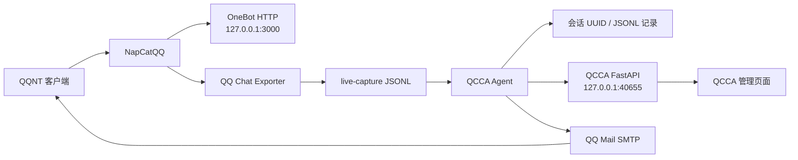

# QCCA-NapCat-QCE

> 基于 NapCatQQ 与 QQ Chat Exporter 的 Windows x64 整合项目，提供聊天记录导出、QCCA 消息处理和本地管理页面。

<p align="center">
  
</p>

<p align="center"><strong>让 QQ 消息流转、记录与自动化处理在同一台 Windows 电脑上协同工作。</strong></p>

[](LICENSE)
[](#系统要求)
[](#系统要求)

**语言 / Language:** [中文](README.md) | [English](README.en.md)

---

## 项目一览

QCCA-NapCat-QCE 把 QQ 登录接入、聊天记录归档和消息自动化串成一条清晰的本地链路：NapCat 接收消息，QQ Chat Exporter 保存并展示记录，QCCA 监听实时消息并调用编码 Agent，最终通过 QQ 邮箱把结果送回发送者。

<p align="center">
  
  &nbsp;&nbsp;&nbsp;
  
</p>

上面的资源来自项目现有前端与品牌素材；QCCA 专属图标也会用于发行版入口和托盘菜单。

### 项目视觉导览

<table>
  <tr>
    <td align="center"><br><sub>QCCA 管理与 Agent 入口</sub></td>
    <td align="center"><br><sub>NapCat 的 QCE 插件</sub></td>
    <td align="center"><br><sub>本地 Web 管理界面</sub></td>
  </tr>
</table>

这些图片均来自仓库内的现有资源，不包含用户聊天内容、QQ 号码或邮箱授权码。

### 组件协作



每个组件都有清晰边界：NapCat 负责 QQ 接入，QCE 负责记录与浏览，QCCA 负责实时处理、会话记忆和管理 API。默认服务只在本机监听，便于个人部署和排查。

## 简介

QCCA-NapCat-QCE 将以下组件整合为一个 Windows 使用包：

| 组件 | 版本 / 用途 |
| --- | --- |
| NapCat | v4.18.19，提供 QQ 与 OneBot 接口 |
| QQ Chat Exporter | v5.5.80，导出并浏览 QQ 聊天记录 |
| QCCA | v1.1.0，处理 live-capture 消息、调用编码 Agent，并通过 QQ 邮箱回复 |
| QCCA API | 基于 FastAPI 的本地管理服务 |

## 功能

- 导出与浏览 QQ 聊天记录。
- 监听 QQ Chat Exporter 的 `live-capture` JSONL 消息。
- 将文本消息交给 Codex Agent 处理。
- 将语音消息通过 FunASR 转写后处理。
- 使用 QQ 邮箱 SMTP 向消息发送者回复。
- 通过本地网页管理 QCCA 的工作区沙箱权限和发件账号。

### 你可以用它做什么

| 场景 | 工作方式 | 结果 |
| --- | --- | --- |
| 聊天归档 | QCE 持续保存 QQ 消息 | 在 Web 页面搜索和浏览历史记录 |
| 自动处理 | QCCA 监听实时捕获并调用 Agent | 将文本或转写后的语音交给 Agent |
| 会话管理 | 每个会话绑定唯一 UUID | 独立查看记录，避免不同会话串线 |
| 邮件回复 | 选择发件 QQ 并配置 SMTP 授权码 | 处理结果通过 QQ 邮箱返回 |

### 一条消息的旅程

```text
QQ / NapCat
    -> QQ Chat Exporter 实时捕获
    -> QCCA Agent（文本、语音识别、Codex）
    -> QQ 邮箱回复
```

所有服务默认只监听 `127.0.0.1`，数据和授权码保存在本机，适合个人电脑或局域网隔离环境。

### 适用场景

- 希望在本机归档、搜索和浏览 QQ 聊天记录。
- 希望将指定 QQ 消息交给编码 Agent 处理，并用 QQ 邮箱返回结果。
- 希望在不把聊天记录、工作目录或邮箱授权码交给第三方服务的前提下运行自动化流程。

本项目是面向 Windows x64 的本地整合包，不是云端托管机器人服务。QQ 登录、聊天记录、QCCA 配置和会话 JSONL 记录均由使用者的电脑保存和管理。

## 1.1.0 更新

- 管理页面新增 Agent 实时状态，可查看当前调用的工作区、会话和会话 ID。
- 管理页面支持按会话读取聊天记录，默认展示最近 200 条。
- 会话记录按 UUID 独立保存为 JSONL，便于备份和排查。
- 发行目录与源码使用相同的记录接口和数据路径。

## 开始使用

1. 将完整包解压至任意目录。
2. 使用发行包时双击 `QCCA-NapCat-QCE.exe`；从源码目录运行时可执行 `launcher-user.bat`。
3. 在 QQ 客户端完成登录。
4. 打开 `http://localhost:40653/qce`，按控制台提示输入访问令牌。
5. 打开 `http://localhost:40653/qce/qcca/` 管理 QCCA 配置。

### 首次运行检查清单

- QQNT 已安装，并能正常启动。
- 使用发行包时从 `QCCA-NapCat-QCE.exe` 启动；源码运行使用 `launcher-user.bat`。
- 登录完成后，确认 `http://127.0.0.1:3000`、`http://127.0.0.1:40653/qce` 和 `http://127.0.0.1:40655/health` 可以访问。
- 需要邮件回复时，在 QCCA 管理页面为发件 QQ 填写授权码。
- 语音识别首次使用可能需要加载 FunASR 模型，请预留磁盘空间和初始化时间。

发行包首次扫码登录时，启动控制台会保持显示，用于展示二维码和启动状态；检测到 NapCat 返回有效 QQ 号后，`QCCA-NapCat-QCE.exe` 会自动隐藏该控制台。QQ 客户端窗口本身不会隐藏。

如需隐藏启动器窗口，可运行 `启动QCCA隐藏.vbs`。它只隐藏 QCCA 的控制台窗口，NapCat 仍会正常启动。

隐藏启动器运行时，QCCA 会在 Windows 任务栏通知区域显示托盘图标。双击图标可打开管理页面，右键可以查看服务状态、停止 QCCA 服务，或退出 QQ、NapCat 和 QCCA。若托盘图标未显示，也可以运行 `qcca\stop-qcca.ps1` 停止 QCCA 服务。

### 独立模式

运行 `start-standalone.bat` 可浏览已经导出的聊天记录，不需要登录 QQ，也不会启动 QCCA。

## QCCA 管理

QCCA 会监听 QQ Chat Exporter 的 `live-capture` JSONL 文件：

- 文本消息会交由 Codex Agent 处理。
- 语音消息会先通过 FunASR 转写成文本，再交由 Codex Agent 处理。
- 处理结果可通过 QQ 邮箱 SMTP 回复给发送消息的用户。
- 管理页面会显示 Agent 当前是否正在调用，并在调用时展示目标工作区、会话和会话 ID。
- 选择工作区与会话后，可以直接查看该会话保存的聊天记录；页面默认展示最近 200 条。

QQ 用户、工作目录和会话由 QCCA 在处理消息时自动写入配置，管理页面不能手动创建或修改它们。可以在管理页面修改已有工作区的沙箱权限、选择发件 QQ，并为各发件 QQ 配置邮箱授权码。

当前登录的 QQ 会自动预留为 SMTP 发件账号，无需手动添加；也可以额外添加其他 QQ 作为发件账号。授权码以明文保存在本机，请妥善保护该文件：

```text
%USERPROFILE%\.qq-chat-exporter\qcca\workspace\smtp.json
```

QCCA 的用户、工作区和会话配置文件：

```text
%USERPROFILE%\.qq-chat-exporter\qcca\workspace\config.json
```

会话聊天记录以 JSONL 格式保存，每个会话使用独立的 UUID 文件：

```text
%USERPROFILE%\.qq-chat-exporter\qcca\record\<session-id>.jsonl
```

默认监听目录：

```text
%USERPROFILE%\Documents\QQChatExporter\live-capture
```

启动前可设置 `QCCA_WATCH_DIR` 环境变量以修改监听目录；设置 `QCCA_API_PORT` 可修改 QCCA API 端口。

## 本地地址与端口

| 地址 / 端口 | 用途 |
| --- | --- |
| `127.0.0.1:3000` | NapCat OneBot HTTP API，QCCA 用于读取登录信息和发送消息 |
| `127.0.0.1:40653` | QQ Chat Exporter Web 页面与 API |
| `127.0.0.1:40654` | QQ Chat Exporter 与 NapCat 的桥接服务 |
| `127.0.0.1:40655` | QCCA FastAPI 管理服务，默认端口，可通过 `QCCA_API_PORT` 修改 |

QCCA API 文档的默认地址是 `http://127.0.0.1:40655/docs`。使用自定义端口时，将地址中的 `40655` 替换为所配置的端口；管理页面可通过 `?apiPort=端口` 指向该 API。

## 系统要求

- 已安装 QQNT。启动器会自动同步本机 QQNT 版本信息。
- Python 3.10 或更高版本，用于 QCCA。
- `ffmpeg`，用于将 AMR 语音转换为 WAV。
- Node.js 18 或更高版本，仅独立模式需要。

首次启动 QCCA 时，会在 `qcca\venv` 创建虚拟环境并安装 Python 依赖。QCCA 使用的依赖包括 `watchdog`、`funasr`、`pysilk`、`torch`、`torchaudio`、`fastapi` 与 `uvicorn`。

## 常见问题

### 启动时提示 `Cannot find package 'express'`

通常是安装包文件损坏或缺失。请重新下载官方完整包，完整解压并覆盖当前目录后重新运行发行入口或 `launcher-user.bat`。

### QCCA 依赖安装失败

检查网络是否能访问 `pypi.tuna.tsinghua.edu.cn`。也可以进入 `qcca` 目录后手动运行：

```powershell
venv\Scripts\pip install -r requirements.txt
```

### QCCA 管理页面无法打开

确认 `launcher-user.bat` 已启动 QCCA API，并打开 `http://127.0.0.1:40655/docs` 检查服务。若端口被占用，请设置 `QCCA_API_PORT` 后重启，并使用：

```text
http://localhost:40653/qce/qcca/?apiPort=端口号
```

### 语音识别失败

确认 `ffmpeg` 已安装并已加入系统 `PATH`。QCCA 会使用它将 AMR 转为 WAV 后再交给 FunASR。

## 原项目与许可证

- NapCat: [NapNeko/NapCatQQ](https://github.com/NapNeko/NapCatQQ)
- QQ Chat Exporter: [shuakami/qq-chat-exporter](https://github.com/shuakami/qq-chat-exporter)

本项目保留原作者信息，并遵循 [GNU General Public License v3.0](https://www.gnu.org/licenses/gpl-3.0.html)（GPL-3.0）。完整许可证见 [LICENSE](LICENSE)。
