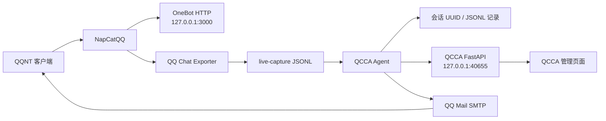

# QCCA-NapCat-QCE

> 基于 NapCatQQ 与 QQ Chat Exporter 的 Windows x64 整合项目。

<p align="center">
  
</p>

[](LICENSE)
[](#系统要求)
[](#系统要求)

**语言 / Language:** [中文](README.md) | [English](README.en.md)

---

## 项目简介

这是一个 Windows x64 整合包，包含 NapCatQQ、QQ Chat Exporter 和 QCCA。NapCatQQ 负责 QQ 登录及 OneBot 接口，QQ Chat Exporter 负责聊天记录导出和浏览，QCCA 读取 QCE 的实时捕获文件并调用编码 Agent。QCCA 另提供一个本地 FastAPI 管理页面。

### 数据流



## 组件

| 组件 | 版本 / 用途 |
| --- | --- |
| NapCat | v4.18.19，提供 QQ 与 OneBot 接口 |
| QQ Chat Exporter | v5.5.80，导出并浏览 QQ 聊天记录 |
| QCCA | v1.2.1，处理 live-capture 消息、调用 Codex / Claude，并通过 QQ 邮箱回复 |
| QCCA API | 基于 FastAPI 的本地管理服务 |

## 功能

- 导出与浏览 QQ 聊天记录。
- 监听 QQ Chat Exporter 的 `live-capture` JSONL 消息。
- 按会话选择 Codex 或 Claude 处理文本消息。
- 将语音消息通过 FunASR 转写后处理。
- 使用 QQ 邮箱 SMTP 向消息发送者回复。
- 通过本地网页管理已有工作区的 Agent 类型、沙箱权限、会话记录和发件 QQ。
- 首次启动提供配置向导，并集中显示 NapCat、QCE、QCCA、Agent、音频模型和 SMTP 状态。

## 1.2.1 更新

- 新增 Codex / Claude 多 Agent 支持，可通过 QQ 指令或管理页面为会话切换 Agent。
- 引入 Agent 注册表与独立适配器目录，后续接入其他编码 Agent 时不必修改消息处理主流程。
- 会话使用全局唯一 UUID，并以独立 JSONL 文件保存人与 Agent 的对话记录。
- 调用 Agent 时会读取当前会话的共享记忆；切换 Agent 后仍能继续使用同一份 QCCA 会话上下文。
- 管理页面可查看 Agent 运行状态、工作区、会话、会话 ID 和最近 200 条聊天记录。
- 管理页面新增会话 Agent 下拉框，同时保持工作目录、会话名称和会话 ID 只读。
- 优化 `/agent`、`/status`、`/sessions`、`/cancel` 等 QQ 指令与失败状态反馈。
- 管理页新增首次配置向导：检查运行环境、选择新会话默认 Agent，并可配置当前登录 QQ 的邮箱授权码。
- 管理页新增统一运行状态总览，服务未启动时显示可直接执行的处理建议。

## 开始使用

1. 将完整包解压至任意目录。
2. 使用发行包时双击 `QCCA-NapCat-QCE.exe`；从源码目录运行 `launcher-user.bat`。
3. 在 QQ 客户端完成登录。
4. 打开 `http://localhost:40653/qce`，按控制台提示输入访问令牌。
5. 打开 `http://localhost:40655/qcca/` 管理 QCCA 配置；该入口由 QCCA API 提供，不依赖 QCE 网页服务。

### 首次运行检查清单

- QQNT 已安装，并能正常启动。
- 使用发行包时从 `QCCA-NapCat-QCE.exe` 启动；源码运行使用 `launcher-user.bat`。
- 登录完成后，确认 `http://127.0.0.1:3000`、`http://127.0.0.1:40653/qce` 和 `http://127.0.0.1:40655/health` 可以访问。
- 使用 Codex 或 Claude 前，确认对应 CLI 已安装、完成登录，并能在当前网络环境中独立执行。
- 第一次打开 QCCA 管理页会出现配置向导；以后可通过页面顶部的“启动向导”再次打开。
- 需要邮件回复时，在 QCCA 管理页面为发件 QQ 填写授权码。
- 语音识别首次使用可能需要加载 FunASR 模型，请预留磁盘空间和初始化时间。

发行包首次扫码登录时，启动控制台会保持显示，用于展示二维码和启动状态；检测到 NapCat 返回有效 QQ 号后，`QCCA-NapCat-QCE.exe` 会自动隐藏该控制台。QQ 客户端窗口本身不会隐藏。

如需隐藏启动器窗口，可运行 `启动QCCA隐藏.vbs`。它只隐藏 QCCA 的控制台窗口，NapCat 仍会正常启动。

隐藏启动器运行时，QCCA 会在 Windows 任务栏通知区域显示托盘图标。双击图标可打开管理页面，右键可以查看服务状态、停止 QCCA 服务，或退出 QQ、NapCat 和 QCCA。若托盘图标未显示，也可以运行 `qcca\stop-qcca.ps1` 停止 QCCA 服务。

### 独立模式

运行 `start-standalone.bat` 可浏览已经导出的聊天记录，不需要登录 QQ，也不会启动 QCCA。

## QCCA 配置与管理

QCCA 会监听 QQ Chat Exporter 的 `live-capture` JSONL 文件：

- 文本消息会交由当前会话选择的 Codex 或 Claude 处理。
- 语音消息会先通过 FunASR 转写成文本，再交由当前会话选择的 Agent 处理。
- 处理结果可通过 QQ 邮箱 SMTP 回复给发送消息的用户。
- 管理页面会显示 Agent 当前是否正在调用，并在调用时展示目标工作区、会话和会话 ID。
- 选择工作区与会话后，可以直接查看该会话保存的聊天记录；页面默认展示最近 200 条。

QQ 用户、工作目录和会话由 QCCA 在处理消息时自动写入配置，管理页面不能修改工作目录、会话名称或会话 ID。可以在管理页面为已有会话选择 Codex 或 Claude、修改沙箱权限、选择发件 QQ，并为各发件 QQ 配置邮箱授权码。

当前登录的 QQ 会自动预留为 SMTP 发件账号，无需手动添加；也可以额外添加其他 QQ 作为发件账号。授权码以明文保存在本机，请妥善保护该文件：

```text
%USERPROFILE%\.qq-chat-exporter\qcca\workspace\smtp.json
```

QCCA 的用户、工作区和会话配置文件：

```text
%USERPROFILE%\.qq-chat-exporter\qcca\workspace\config.json
```

### QQ 指令

在 QQ 中发送以下指令可查询或切换 QCCA：

```text
/help                         查看全部指令
/status                       查看当前工作区、会话、Agent 和沙箱权限
/sessions                     列出已保存的会话
/agent                        查看当前 Agent
/agent=codex                  下一条消息使用 Codex
/agent=claude                 下一条消息使用 Claude
/workspace="路径" session=名称 agent=claude sandbox=权限
                              设置待下一条消息生效的组合参数
/cancel                       取消所有待生效的切换参数
```

切换参数会按 QQ 用户分别保存，并在下一条普通消息调用 Agent 时一次性应用。多个切换指令可以分开发送；未知的 `/` 指令不会被当作编码任务执行。

会话聊天记录以 JSONL 格式保存，每个会话使用独立的 UUID 文件：

```text
%USERPROFILE%\.qq-chat-exporter\qcca\record\<session-id>.jsonl
```

默认监听目录：

```text
%USERPROFILE%\Documents\QQChatExporter\live-capture
```

启动前可设置 `QCCA_WATCH_DIR` 环境变量修改监听目录；设置 `QCCA_API_PORT` 修改 QCCA API 端口。

## 本地地址与端口

| 地址 / 端口 | 用途 |
| --- | --- |
| `127.0.0.1:3000` | NapCat OneBot HTTP API，QCCA 用于读取登录信息和发送消息 |
| `127.0.0.1:40653` | QQ Chat Exporter Web 页面与 API |
| `127.0.0.1:40654` | QQ Chat Exporter 与 NapCat 的桥接服务 |
| `127.0.0.1:40655` | QCCA FastAPI 管理服务，默认端口，可通过 `QCCA_API_PORT` 修改 |

QCCA API 文档的默认地址是 `http://127.0.0.1:40655/docs`，管理页面的独立入口是 `http://127.0.0.1:40655/qcca/`。使用自定义端口时，将地址中的 `40655` 替换为所配置的端口。

## 系统要求

- 已安装 QQNT。启动器会自动同步本机 QQNT 版本信息。
- Python 3.10 或更高版本，用于 QCCA。
- `ffmpeg`，用于将 AMR 语音转换为 WAV。
- 至少安装并登录一个受支持的编码 Agent CLI：Codex CLI 或 Claude Code。
- Node.js 18 或更高版本，仅独立模式需要。

首次启动 QCCA 时，会在 `qcca\.venv` 创建虚拟环境并安装 Python 依赖。QCCA 使用的依赖包括 `watchdog`、`funasr`、`pysilk`、`torch`、`torchaudio`、`fastapi` 与 `uvicorn`。

Windows 发行包不会携带开发机的 `.venv`、模型缓存或个人配置。首次启动需要联网安装 Python 依赖，因此初始化时间取决于网络速度；后续启动会复用已创建的环境。

不要从其他电脑复制 `qcca\\.venv`。虚拟环境会记录创建它的 Python 安装路径；如果路径失效，启动器会检测到并自动重建环境。

## 常见问题

### 启动时提示 `Cannot find package 'express'`

通常是安装包文件损坏或缺失。请重新下载官方完整包，完整解压并覆盖当前目录后重新运行发行入口或 `launcher-user.bat`。

### QCCA 依赖安装失败

检查网络是否能访问 `pypi.tuna.tsinghua.edu.cn`。也可以进入 `qcca` 目录后手动运行：

```powershell
.venv\Scripts\pip install -r requirements.txt
```

如果日志出现 `No module named encodings`，说明现有 `.venv` 已损坏或来自另一台电脑。关闭 QCCA 后删除 `qcca\\.venv`，再运行启动器即可自动创建新的环境。

### QCCA 管理页面无法打开

确认 `launcher-user.bat` 已启动 QCCA API，并打开 `http://127.0.0.1:40655/docs` 检查服务。若端口被占用，请设置 `QCCA_API_PORT` 后重启，并使用：

```text
http://localhost:40655/qcca/
```

### 语音识别失败

确认 `ffmpeg` 已安装并已加入系统 `PATH`。QCCA 使用它将 AMR 转为 WAV 后再交给 FunASR。

### Claude 已登录但调用失败

先在命令行运行 `claude auth status` 确认登录状态，再直接执行一次 `claude --print "你好"` 检查 API 连通性。仅完成登录不代表当前网络可以访问 Claude API。CC Switch 不是必需组件；只有主动使用 CC Switch 或其他代理时，才需要启动所选线路，并确认 Claude CLI 可以独立返回结果。

## 原项目与许可证

- NapCat: [NapNeko/NapCatQQ](https://github.com/NapNeko/NapCatQQ)
- QQ Chat Exporter: [shuakami/qq-chat-exporter](https://github.com/shuakami/qq-chat-exporter)

本项目保留原作者信息，并遵循 [GNU General Public License v3.0](https://www.gnu.org/licenses/gpl-3.0.html)（GPL-3.0）。完整许可证见 [LICENSE](LICENSE)。
